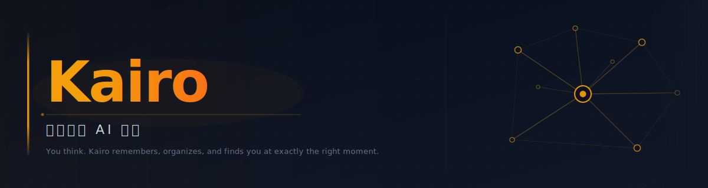

<div align="center">



<h1>Kairo · 個人全能 AI 秘書</h1>

<p><b>你思考。Kairo 記憶、整理、跟進 — 在恰好的時刻主動找到你。</b><br/>
<i>You think. Kairo remembers, organizes, and follows up — finding you at exactly the right moment.</i></p>

<a href="https://github.com/sou350121/Kairo-KenVersion"></a>
<a href="https://github.com/sou350121/Kairo-KenVersion/blob/main/LICENSE"></a>


</div>

---

## 項目概覽

### 知識工作者面臨的六大困境

我們每天都生活在信息的漩渦裡。在 AI 工具爆炸的今天，效率問題不是工具不夠多，而是工具太被動、太碎散、太孤立：

- **輸入碎片化**：想法在微信群，任務在 Notion，郵件在 Gmail，行程在飛書，聯絡人在通訊錄。碎散在 5 個 App 裡的信息，沒有任何一個地方讓你看清全局
- **工具只能被動等待**：所有工具都在等你去找它們。記事本不會在周五下午提醒你「這件事你還沒做」，待辦清單不會在早上告訴你「今天最重要的三件事是什麼」。你的記憶負擔，沒有任何人幫你分擔
- **捕捉阻力導致遺忘**：好想法發生在地鐵、咖啡館、剛入睡前。打開 App → 找到頁面 → 選格式 → 輸入——這四步足以讓你放棄。你說「等一下再記」，然後永遠忘了
- **待辦只有進，沒有出**：你確實記了，但沒有系統去跟進它、提醒它、在逾期時主動找你。任務靜靜躺在清單裡，一條一條堆積，最後你連打開都不想
- **郵件與行程形同孤島**：每天早上要切換 Gmail、飛書日曆、微信群三個地方，才能拼出「今天要做什麼」。任何一個遺漏，就是錯過的會議或沒回的重要郵件
- **數據主權喪失**：你花幾年積累的筆記、任務、人脈，全部住在別人的服務器上。他們漲價、關服、或被收購，你的資產就不再屬於你

### Kairo 的解法

Kairo 不是又一個筆記 App，也不是又一個 AI 助手。它是一套**主動運行在你服務器上的個人 AI 秘書系統**，通過你每天本來就在用的 IM（Telegram/飛書）與你互動：

- **統一捕捉入口 → 解決碎片化**：你的 Telegram 或飛書就是唯一入口。自然語言輸入，Kairo 自動識別 10 種意圖並分類建卡，無需打開任何其他 App
- **Heartbeat 主動推送 → 解決被動等待**：Kairo 定時掃描你的任務、郵件、行程，到時間主動找你。你不需要記得去查，它會在恰好的時刻出現
- **零摩擦捕捉 → 解決遺忘問題**：說話即捕捉。1 秒輸入，Kairo 自動建立正確類型的卡片，存入本地文件系統，永不丟失
- **完整任務閉環 → 解決待辦堆積**：從捕捉到建卡，從排程到提醒，從跟進到標記完成——每一步由 Kairo 自動完成，你只需要決策
- **郵件 + 日曆自動接入 → 解決信息孤島**：每日 07:00 自動讀取飛書日曆和 Gmail，彙整成一條晨報推送給你，早上一條訊息看完全局
- **本地 Markdown + 自託管 → 解決數據主權**：所有數據是 Markdown 文件，存在你自己的機器上。零訂閱費，永不被鎖定，人類可讀，隨時可遷移

---

## 為什麼是 Kairo，不是其他工具

```
┌─────────────────────────────────────────────────────────────────┐
│                                                                 │
│   所有工具都在等你去找它們。                                       │
│   Kairo 在你需要的時候，主動找到你。                               │
│                                                                 │
└─────────────────────────────────────────────────────────────────┘
```

| 能力                                |  **Kairo**  | ChatGPT Pulse |  Notion AI   |    Mem.ai     |   Lindy.ai    |   n8n (DIY)   |
| ----------------------------------- | :---------: | :-----------: | :----------: | :-----------: | :-----------: | :-----------: |
| 推送到你常用的 IM（Telegram/飛書）  |     ✅      |  ❌ App only  | ❌ App only  |  ❌ App only  |    ⚠️ 部分    |   🔧 自己搭   |
| 主動晨報 + 定時提醒（Heartbeat）    |     ✅      |   ⚠️ 僅晨報   |      ❌      |      ❌       |      ❌       |   🔧 自己搭   |
| 自然語言 → 自動分類捕捉             | ✅ 10種意圖 |      ❌       |      ❌      |  ⚠️ 筆記only  |      ❌       |   🔧 自己搭   |
| 完整任務閉環（捕捉→提醒→跟進→完成） |     ✅      |      ❌       |      ❌      |      ❌       |  ⚠️ 商業流程  |   🔧 自己搭   |
| 本地優先，數據在你手上              | ✅ Markdown |  ❌ OpenAI雲  | ❌ Notion雲  |   ❌ Mem雲    |  ❌ Lindy雲   |      ✅       |
| 自託管，零訂閱費                    |     ✅      |  ❌ $200/月   | ❌ $20/人/月 |   ❌ $12/月   | ❌ $30~200/月 | ✅ 但需DevOps |
| 決策智慧注入（Naval/Munger/Dalio）  | ✅ 每次對話 |      ❌       |      ❌      |      ❌       |      ❌       |      ❌       |
| 郵件 + 日曆自動摘要推送             |     ✅      | ⚠️ Gmail only |      ❌      | ⚠️ 有但不推送 |  ⚠️ 商業場景  |   🔧 自己搭   |

> 💡 **最接近 Kairo 的競品是 n8n** — 它也自託管也能接 Telegram，但你要花幾百小時自己搭建每一個功能，且沒有任何個人生產力的內建心智模型。Kairo 是一個已經搭好的系統，開箱即用。

---

## 核心理念

成功運行後，讓我們深入了解 Kairo 的設計理念。六大核心理念與前面提到的解法一一對應：

### 1. 自然語言捕捉管道 → 解決碎片化與遺忘

Kairo 不要求你學任何格式或語法。你說話，它理解。支援 **10 種意圖類型**，每一種都有對應的卡片格式：

| 類型        | 說明                   | 範例輸入                                             |
| ----------- | ---------------------- | ---------------------------------------------------- |
| `action`    | 需要執行的任務         | 「幫我記一下要回覆王總的郵件」                       |
| `timeline`  | 有 deadline 的事項     | 「周五前要把報告發給王總」                           |
| `watch`     | 需要持續跟進的事       | 「關注一下 Jason 那邊合同的進度」                    |
| `idea`      | 靈感 / 想法            | 「記一下：可以用 AI 自動化對帳流程」                 |
| `memory`    | 要記住的人或事         | 「記住：客戶 A 對紅色很敏感」                        |
| `belief`    | 認知 / 原則 / 思維框架 | 「Naval 說的 Leverage 理論值得深入研究」             |
| `reference` | 資料 / 連結 / 論文     | 「這篇文章很好，記下來」                             |
| `question`  | 待解答的問題           | 「為什麼 GPT-4o 在代碼上比 Claude 弱？」             |
| `highlight` | 值得摘錄的金句         | 「費曼說：如果你不能簡單解釋它，你就沒有真正理解它」 |
| `person`    | 聯絡人資訊             | 「Jason，前百度 PM，現在在做 AI 教育」               |

置信度 ≥ 85% 自動建卡並靜默確認；低於時顯示選單讓你選擇，避免誤判。

### 2. Heartbeat 主動推送系統 → 解決被動等待

這是 Kairo 與所有其他工具最根本的區別。Heartbeat 是一個持續運行的後台系統，定時掃描你的任務狀態、逾期事項、待跟進清單，在恰好的時刻主動把信息推到你的 IM 裡：

```
07:00  → 讀取飛書日曆，彙整今日行程
07:10  → 讀取 Gmail，整理重要郵件
08:00  → 晨報推送：今日行程 + 逾期任務 + 郵件摘要
09:00  → 「你說過今天要跟 Jason 確認合同，現在是個好時機」
20:30  → 「這週有 3 件事還沒完成，要我幫你重新排程嗎？」
```

你不需要打開任何 App，Kairo 在你需要的時候出現。

### 3. Hub Context 注入 → 解決信息孤島

每一次你發訊息給 Kairo，它都不是在對話一個空白的 AI。系統自動將 **9 個信息來源**注入 LLM 上下文，讓秘書在回應你之前，已經知道：

```
┌─────────────────────────────────────────────────┐
│  今日 / 昨日記錄      最近的行動與思考            │
│  未完成待辦          tasks_master.md 未完成項目   │
│  今日郵件            Gmail + Outlook 自動摘要      │
│  今日行程            飛書日曆自動同步              │
│  長期路線圖          你的季度目標與里程碑          │
│  追蹤中              waiting.md 所有跟進事項       │
│  近期月摘要          最近兩個月的記憶壓縮          │
│  相關聯絡人          對話中涉及的人名卡片          │
│  決策智慧            7位思想家的核心框架           │
└─────────────────────────────────────────────────┘
```

這意味著你說「幫我想想怎麼回覆 Jason」，Kairo 已經知道 Jason 是誰、你們上次說了什麼、你目前的處境與目標。

### 4. 完整任務閉環 → 解決待辦堆積

大多數工具在「捕捉」這一步就停止了。Kairo 的閉環從捕捉開始，一直延伸到完成：

```
你說話  →  意圖識別  →  建立任務卡片  →  自動排程 cron
                                              │
你確認完成  ←  自動更新狀態  ←  跟進追蹤  ←  時間到主動找你
```

每個有截止日期的任務，Kairo 在建卡時就自動在 cron 系統裡排好提醒。到期前它來找你，不需要你記得。

### 5. 郵件 + 日曆自動接入 → 解決信息孤島

| 數據源                  | 接入方式                    | 更新頻率   | 輸出                  |
| ----------------------- | --------------------------- | ---------- | --------------------- |
| Gmail                   | OAuth Pub/Sub webhook       | 每日 07:10 | `02_work/gmail.md`    |
| 飛書個人日曆            | OAuth user token + 自動刷新 | 每日 07:00 | `02_work/calendar.md` |
| Outlook / 163 / QQ Mail | IMAP（自動識別域名）        | 可配置     | `02_work/*-mail.md`   |

所有數據彙整後，Hub Context 自動注入，LLM 每次對話都有最新的郵件與行程背景。

### 6. 本地 Markdown + 自託管 → 解決數據主權

所有信息以 Markdown 文件形式存於本地，結構清晰，人類可讀，永不鎖定：

```
~/.openclaw/workspace/
├── 00_inbox/              ← 所有原始輸入，永不刪除
├── 02_work/
│   ├── tasks/             ← 任務卡片（每個任務一個文件）
│   ├── tasks_master.md    ← 任務總索引
│   ├── waiting.md         ← 跟進中清單（含 checkpoint）
│   ├── calendar.md        ← 每日行程（飛書自動同步）
│   └── gmail.md           ← 郵件摘要（每日自動寫入）
├── 03_life/
│   └── daily_logs/        ← 每日記憶（LLM 自動彙整）
└── 04_knowledge/
    ├── people/            ← 聯絡人卡片（對話中自動更新）
    ├── beliefs/           ← 決策智慧（Naval/Munger/Dalio 等7位）
    ├── roadmap.md         ← 長期路線圖
    └── monthly_digest/    ← 月度記憶壓縮
```

明天 Notion 漲價，你的數據在你自己的機器上，一行代碼都不會丟。

---

## 📰 情報中心 — Kairo 每日推送

> Kairo 自動抓取、整理並推送至你的 Telegram / 飛書，無需主動查看。

| 欄目                | 說明                              | 文件路徑規則                                                          | 排程（北京時間）          |
| ------------------- | --------------------------------- | --------------------------------------------------------------------- | ------------------------- |
| 📋 **工具日報**     | 今日值得關注的 AI 工具速覽        | [`content/daily/YYYY-MM-DD-tools.md`](./content/daily/)               | 每日 07:00                |
| ⭐ **編輯精選**     | 跨域重要事件，附編輯觀點          | [`content/daily/YYYY-MM-DD-picks.md`](./content/daily/)               | 每日 07:15                |
| 🔥 **社交情報**     | 大 V 觀點 · 社區爭議 · Viral 內容 | [`content/daily/YYYY-MM-DD-social.md`](./content/daily/)              | 每日 07:45                |
| 🔍 **架構深評**     | 生產踩坑 + AI 代碼盲點分析        | [`content/frameworks/YYYY-MM-DD-review.md`](./content/frameworks/)    | 周二 / 四 / 六 15:30      |
| 💡 **工作流靈感**   | 「我用 AI 自動化了 X」真實案例    | [`content/daily/YYYY-MM-DD-workflow.md`](./content/daily/)            | 周一 / 三 / 五 / 日 15:45 |
| 📊 **雙週推理報告** | 趨勢預測 + 歷史準確率追蹤         | [`content/reports/biweekly/YYYY-WNN.md`](./content/reports/biweekly/) | 隔週一 08:00              |

> 📁 所有輸出文件存於 `content/`，Markdown 格式，完整可搜索，不依賴任何雲服務。

---

## 系統架構

```
[你的輸入：文字 / 圖片 / 語音]
         │
         ▼
┌─────────────────────────────┐
│       OpenClaw 閘道          │  ← 多頻道統一接收
│  Telegram · 飛書 · Discord  │
└─────────────┬───────────────┘
              │
     ┌────────▼─────────┐          ┌────────────────────┐
     │   Capture Agent  │          │    Cron Scheduler  │
     │  意圖識別 · 10分類 │          │  晨報·提醒·郵件·日曆  │
     └────────┬─────────┘          └──────────┬─────────┘
              │                               │
              └──────────────┬────────────────┘
                             ▼
              ┌──────────────────────────┐
              │     assistant_hub（本地） │
              │  Markdown · 任務 · 日誌  │
              └──────────────┬───────────┘
                             │
              ┌──────────────▼───────────┐
              │       Hub Context        │  ← 9個信息源注入每次對話
              │  郵件·行程·待辦·人脈·智慧  │
              └──────────────┬───────────┘
                             │
                             ▼
                    ┌─────────────────┐
                    │    Heartbeat    │  ← 定期掃描 → 主動推送
                    └─────────────────┘
```

---

## 快速開始

> ⚠️ **這是 Ken 的個人生產環境版本。** 公開易用版 Kairo 正在規劃中。以下為技術用戶的參考流程。

### 環境要求

- Node.js ≥ 22 · pnpm ≥ 9 · Linux / macOS

### 1. 克隆並安裝

```bash
git clone https://github.com/sou350121/Kairo-KenVersion.git
cd Kairo-KenVersion
pnpm install && pnpm ui:build && pnpm build
```

### 2. 最小配置

創建配置文件 `~/.openclaw/openclaw.json`：

```jsonc
{
  "channels": {
    "telegram": {
      "enabled": true,
      "token": "YOUR_BOT_TOKEN", // 從 @BotFather 申請
    },
  },
  "agents": {
    "defaults": {
      "model": {
        "primary": "openai-codex/gpt-5.3-codex", // 或任何 OpenAI-compatible model
      },
    },
  },
  "gateway": {
    "port": 18789,
  },
}
```

<details>
<summary><b>進階配置：接入 Gmail</b></summary>

```jsonc
{
  "capture": {
    "gmail": {
      "enabled": true,
      "clientId": "YOUR_OAUTH_CLIENT_ID",
      "clientSecret": "YOUR_OAUTH_CLIENT_SECRET",
    },
  },
}
```

</details>

<details>
<summary><b>進階配置：接入飛書日曆</b></summary>

```jsonc
{
  "capture": {
    "feishu": {
      "enabled": true,
      "appId": "YOUR_FEISHU_APP_ID",
      "appSecret": "YOUR_FEISHU_APP_SECRET",
    },
  },
}
```

</details>

### 3. 啟動

```bash
node scripts/run-node.mjs gateway --port 18789
```

### 4. 驗證

打開 Telegram，向你的 Bot 發送：

```
提醒我明天上午 10 點跟 Jason 確認合同
```

預期結果：

```
✅ 已建立任務卡片
📋 類型：timeline
📅 截止：2026-02-28 10:00
⏰ 已排程提醒

明天上午 10:00 我會主動提醒你。
```

控制台：`http://localhost:18789`

---

## 支援頻道

| 頻道        | 狀態      | 備註                   |
| ----------- | --------- | ---------------------- |
| Telegram    | ✅ 穩定   | 推薦，最成熟           |
| 飛書 / Lark | ✅ 穩定   | WebSocket，無需公網 IP |
| Discord     | ✅ 穩定   |                        |
| Slack       | ✅ 穩定   |                        |
| WhatsApp    | 🚧 測試中 |                        |
| WeChat      | 🚧 規劃中 |                        |

---

## 項目結構

```
Kairo-KenVersion/
├── src/
│   ├── auto-reply/         ← Capture Agent · Hub Context 注入（9個信息源）
│   ├── cron/               ← 定時任務引擎 · Heartbeat 排程
│   ├── gateway/            ← 多頻道閘道（Telegram · 飛書 · Discord）
│   └── infra/              ← Heartbeat 主動推送 · 系統事件
├── scripts/capture/        ← 郵件摘要 · 飛書日曆 · 任務掃描腳本
├── extensions/feishu/      ← 飛書 channel plugin（完整實現）
├── content/                ← 每日情報中心輸出目錄
│   ├── daily/              ← 工具日報 · 編輯精選 · 社交情報 · 工作流靈感
│   ├── frameworks/         ← 架構深評（周二 / 四 / 六）
│   └── reports/biweekly/   ← 雙週推理報告
└── ui/                     ← 控制台 Web UI（Lit + Vite）
```

---

## 路線圖

- [x] 多頻道捕捉（Telegram / 飛書）
- [x] 智能意圖識別（10 種類型）
- [x] 本地 Markdown 文件系統
- [x] Heartbeat 主動推送系統
- [x] 郵件摘要（Gmail / 飛書日曆 / Outlook）
- [x] 聯絡人記憶卡片（自動建立與更新）
- [x] 決策智慧注入（Naval · Munger · Dalio 等 7 位）
- [x] Hub Context 9個信息源注入
- [x] 每日情報中心（content/ 目錄結構）
- [ ] **公開易用版** — 5 分鐘部署，零配置負擔
- [ ] Setup Wizard（CLI 引導式設定）
- [ ] Docker 一鍵啟動
- [ ] 多語言支援（English / 日本語）

---

## 致謝

Kairo 基於 **[OpenClaw](https://github.com/openclaw/openclaw)** 構建。感謝 OpenClaw 團隊提供堅實的多頻道 AI 閘道基礎。

---

## License

MIT License — 詳見 [LICENSE](./LICENSE)
