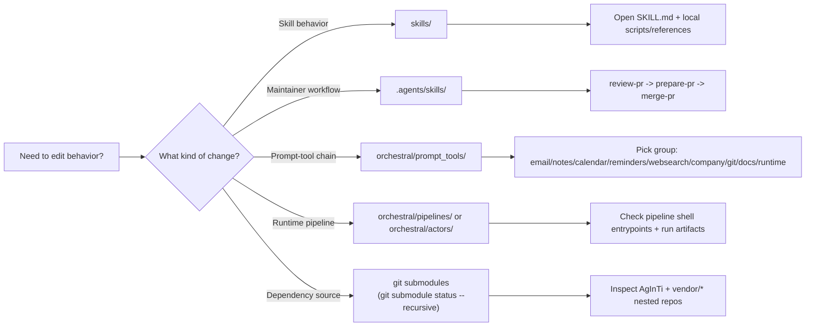
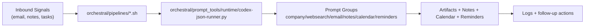

[English](README.md) · [العربية](i18n/README.ar.md) · [Español](i18n/README.es.md) · [Français](i18n/README.fr.md) · [日本語](i18n/README.ja.md) · [한국어](i18n/README.ko.md) · [Tiếng Việt](i18n/README.vi.md) · [中文 (简体)](i18n/README.zh-Hans.md) · [中文（繁體）](i18n/README.zh-Hant.md) · [Deutsch](i18n/README.de.md) · [Русский](i18n/README.ru.md)

[](https://github.com/lachlanchen/lachlanchen/blob/main/figs/banner.png)

# 🐼 LazyingArtBot (LAB)

[](LICENSE)
[](https://nodejs.org)
[](pnpm-workspace.yaml)
[](https://github.com/openclaw/openclaw)
[](#quick-start)
[](package.json)
[](#skills-and-orchestration-surfaces)
[](#skills-and-orchestration-surfaces)
[](#skills-and-orchestration-surfaces)
[](#git-submodules)
[](i18n)
[](docs)
[](https://github.com/lachlanchen/LazyingArtBot/stargazers)
[](https://github.com/lachlanchen/LazyingArtBot/issues)

> 🌍 **i18n status:** `i18n/` exists and currently includes localized README files for Arabic, German, Spanish, French, Japanese, Korean, Russian, Vietnamese, Simplified Chinese, and Traditional Chinese. This English README is the canonical source for incremental updates.

**LazyingArtBot** is my personal AI assistant stack for **lazying.art**, built on top of OpenClaw and adapted for daily workflows: multi-channel chat, local-first control, and email -> calendar/reminder/notes automation.

| 🔗 Link          | URL                                          | Focus                               |
| ---------------- | -------------------------------------------- | ----------------------------------- |
| 🌐 Website       | https://lazying.art                          | Primary domain and status dashboard |
| 🤖 Bot domain    | https://lab.lazying.art                      | Chat and assistant entrypoint       |
| 🧱 Upstream base | https://github.com/openclaw/openclaw         | OpenClaw platform foundation        |
| 📦 This repo     | https://github.com/lachlanchen/LazyingArtBot | LAB-specific adaptations            |

---

## Table of contents

- [Overview](#overview)
- [At a glance](#at-a-glance)
- [Features](#features)
- [Core capabilities](#core-capabilities)
- [Repository topology (Mermaid)](#repository-topology-mermaid)
- [Project structure](#project-structure)
- [Skills and orchestration surfaces](#skills-and-orchestration-surfaces)
- [Git submodules](#git-submodules)
- [Prerequisites](#prerequisites)
- [Quick start](#quick-start)
- [Installation](#installation)
- [Usage](#usage)
- [Configuration](#configuration)
- [Deployment modes](#deployment-modes)
- [LazyingArt workflow focus](#lazyingart-workflow-focus)
- [Orchestral philosophy](#orchestral-philosophy)
- [Prompt tools in LAB](#prompt-tools-in-lab)
- [Examples](#examples)
- [Development notes](#development-notes)
- [Troubleshooting](#troubleshooting)
- [LAB ecosystem integrations](#lab-ecosystem-integrations)
- [Install from source (quick reference)](#install-from-source-quick-reference)
- [Roadmap](#roadmap)
- [Contributing](#contributing)
- [Acknowledgements](#acknowledgements)
- [❤️ Support](#-support)
- [Contact](#contact)
- [License](#license)

---

## Overview

LAB focuses on practical personal productivity:

- ✅ Run one assistant across chat channels you already use.
- 🔐 Keep data and control on your own machine/server.
- 📬 Convert incoming email into structured actions (Calendar, Reminders, Notes).
- 🛡️ Add guardrails so automation is useful but still safe.

In short: less busywork, better execution.

---

## At a glance

| Area                            | Current baseline in this repo                             |
| ------------------------------- | --------------------------------------------------------- |
| Runtime                         | Node.js `>=22.12.0`                                       |
| Package manager                 | `pnpm@10.23.0`                                            |
| Core CLI                        | `openclaw`                                                |
| Default local gateway           | `127.0.0.1:18789`                                         |
| Default bridge port             | `127.0.0.1:18790`                                         |
| Primary docs                    | `docs/` (Mintlify)                                        |
| Primary LAB orchestration       | `orchestral/` + `orchestral/prompt_tools/`                |
| Skill surfaces                  | `skills/` (55 local skills) + `.agents/skills/` workflows |
| README i18n location            | `i18n/README.*.md`                                        |
| Git submodules (recursive view) | 11 entries (top-level + nested)                           |

---

## Features

- 🌐 Multi-channel assistant runtime with a local gateway.
- 🖥️ Browser dashboard/chat surface for local operations.
- 🧰 Tool-enabled automation pipeline (scripts + prompt-tools).
- 📨 Email triage and conversion into Notes, Reminders, and Calendar actions.
- 🧩 Plugin/extension ecosystem (`extensions/*`) for channels/providers/integrations.
- 📱 Multi-platform surfaces in-repo (`apps/macos`, `apps/ios`, `apps/android`, `ui`).
- 🧠 Layered skill system:
  - user-facing local skill catalog in `skills/`
  - maintainer workflow skills in `.agents/skills/`

---

## Core capabilities

| Capability                      | What it means in practice                                                                             |
| ------------------------------- | ----------------------------------------------------------------------------------------------------- |
| Multi-channel assistant runtime | Gateway + agent sessions across channels you enable                                                   |
| Web dashboard / chat            | Browser-based control surface for local operations                                                    |
| Tool-enabled workflows          | Shell + file + automation script execution chains                                                     |
| Email automation pipeline       | Parse mail, classify action type, route to Notes/Reminders/Calendar, log actions for review/debugging |

Pipeline steps preserved from current workflow:

- parse inbound mail
- classify action type
- save to Notes / Reminders / Calendar
- log every action for review and debugging

---

## Repository topology (Mermaid)

This section is the fast system map for operators. It explicitly highlights `skills/`, `.agents/skills/`, `orchestral/prompt_tools/`, and git submodules (including nested submodules visible in this checkout).

### System map

```mermaid
flowchart TD
  REPO["LazyingArtBot Repository"]

  REPO --> CORE["src/ + extensions/ + ui/ + apps/ + docs/"]
  REPO --> SKILLS["skills/\n(local skill catalog)"]
  REPO --> AGSKILLS[".agents/skills/\n(maintainer workflows)"]
  REPO --> ORCH["orchestral/"]
  REPO --> SUBS["git submodules (recursive)"]

  ORCH --> ORCH_PIPE["pipelines/ + pipelines.yml"]
  ORCH --> ORCH_PROMPTS["prompt_tools/"]
  ORCH --> ORCH_ACTORS["actors/ + scripts/ + config/ + references/"]

  ORCH_PROMPTS --> PT_RUNTIME["runtime/"]
  ORCH_PROMPTS --> PT_COMPANY["company/"]
  ORCH_PROMPTS --> PT_WEB["websearch/"]
  ORCH_PROMPTS --> PT_EMAIL["email/"]
  ORCH_PROMPTS --> PT_NOTES["notes/"]
  ORCH_PROMPTS --> PT_CAL["calendar/"]
  ORCH_PROMPTS --> PT_REM["reminders/"]
  ORCH_PROMPTS --> PT_MIG["migration/"]
  ORCH_PROMPTS --> PT_GIT["git/"]
  ORCH_PROMPTS --> PT_DOCS["docs/"]

  SUBS --> SUB_AGINTI["AgInTi/"]
  SUBS --> SUB_COOKBOOK["vendor/openai-cookbook"]
  SUBS --> SUB_STWS["vendor/SillyTavern-WebSearch-Selenium"]

  SUB_AGINTI --> SA_APPDEV["AutoAppDev"]
  SUB_AGINTI --> SA_NOVEL["AutoNovelWriter"]
  SUB_AGINTI --> SA_ORG["OrganoidAgent"]
  SUB_AGINTI --> SA_PAPER["PaperAgent"]
  SUB_AGINTI --> SA_LRE["LifeReverseEngineering"]

  SA_LRE --> SA_LEARN["learn (LazyLearn)"]
  SA_LRE --> SA_EARN["earn (LazyEarn)"]
  SA_LRE --> SA_IDEAS["IDEAS"]

  classDef core fill:#E0F2FE,stroke:#0284C7,color:#0C4A6E;
  classDef orchestral fill:#FEF3C7,stroke:#D97706,color:#78350F;
  classDef skills fill:#DCFCE7,stroke:#16A34A,color:#14532D;
  classDef submodule fill:#F3E8FF,stroke:#7C3AED,color:#4C1D95;

  class REPO,CORE core;
  class ORCH,ORCH_PIPE,ORCH_PROMPTS,ORCH_ACTORS,PT_RUNTIME,PT_COMPANY,PT_WEB,PT_EMAIL,PT_NOTES,PT_CAL,PT_REM,PT_MIG,PT_GIT,PT_DOCS orchestral;
  class SKILLS,AGSKILLS skills;
  class SUBS,SUB_AGINTI,SUB_COOKBOOK,SUB_STWS,SA_APPDEV,SA_NOVEL,SA_ORG,SA_PAPER,SA_LRE,SA_LEARN,SA_EARN,SA_IDEAS submodule;
```



### Operator navigation map



Assumption notes (from current local snapshot):

- `AgInTi/AutoNovelWriter`, `AgInTi/OrganoidAgent`, and `AgInTi/PaperAgent` are declared nested submodules but currently uninitialized.
- `AgInTi/LifeReverseEngineering` is initialized and present, but checked out at a commit that differs from the parent-recorded commit.
- `vendor/a2ui` exists as a vendored directory, not a declared git submodule in `.gitmodules`.

---

## Project structure

High-level repository layout:

```text
.
├─ src/                     # core runtime, gateway, channels, CLI, infra
├─ extensions/              # optional channel/provider/auth plugins
├─ skills/                  # local skill catalog (55 skill directories)
├─ .agents/skills/          # maintainer workflow skills + PR_WORKFLOW.md
├─ orchestral/              # LAB orchestration pipelines + prompt tools
├─ scripts/                 # build/dev/test/release/helpers
├─ ui/                      # web dashboard UI package
├─ apps/                    # macOS / iOS / Android apps
├─ docs/                    # Mintlify documentation
├─ references/              # LAB references and operating notes
├─ test/                    # test suites
├─ i18n/                    # localized README files
├─ vendor/                  # vendored and submodule-backed dependencies
├─ AgInTi/                  # ecosystem submodule tree
├─ .env.example             # environment template
├─ docker-compose.yml       # gateway + CLI containers
├─ README_OPENCLAW.md       # larger upstream-style reference README
└─ README.md                # this LAB-focused README
```

Notes:

- `orchestral/prompt_tools` is the canonical location for LAB Codex prompt-tooling.
- Root `i18n/` contains localized README variants.
- `.github/workflows.disabled/` is present in this snapshot; active CI behavior should be verified before relying on workflow assumptions.

---

## Skills and orchestration surfaces

### Quick navigation table

| Surface                    | Path                       | What to open first                                      | Typical reason                                     |
| -------------------------- | -------------------------- | ------------------------------------------------------- | -------------------------------------------------- |
| Local skill catalog        | `skills/`                  | `skills/<skill-name>/SKILL.md`                          | User-facing skill behavior and local automations   |
| Maintainer workflow skills | `.agents/skills/`          | `.agents/skills/PR_WORKFLOW.md`                         | PR triage/review/prepare/merge flow                |
| Orchestral pipelines       | `orchestral/pipelines/`    | shell entrypoint for the pipeline                       | Scheduled and deterministic runs                   |
| Prompt-tool groups         | `orchestral/prompt_tools/` | target group folder (`email`, `notes`, `runtime`, etc.) | Tool contracts and chain composition               |
| Submodule roots            | `AgInTi/`, `vendor/*`      | `.gitmodules` + `git submodule status --recursive`      | Cross-repo dependency and upstream source tracking |

### `skills/` (local skill catalog)

- Contains 55 skill directories in this snapshot.
- Each skill is typically anchored by `SKILL.md` and may include scripts/references.
- Examples: `skills/github`, `skills/discord`, `skills/voice-call`, `skills/session-logs`.

### `.agents/skills/` (maintainer workflow skills)

- Current workflow skills:
  - `review-pr`
  - `prepare-pr`
  - `merge-pr`
  - `mintlify`
- `PR_WORKFLOW.md` defines the script-first maintainer sequence:
  - `review-pr` -> `prepare-pr` -> `merge-pr`

### `orchestral/` and `orchestral/prompt_tools/`

`orchestral/` currently includes:

- `pipelines/` (sync/async daily pipeline entrypoints + cron setup)
- `pipelines.yml` (pipeline manifest)
- `actors/` (automation actors, including automail2note)
- `scripts/` (calendar/reminder migration helpers)
- `config/` and `references/`
- `prompt_tools/` (Codex prompt tooling groups + runtime runners)

`orchestral/prompt_tools/` functional group layout:

- `runtime/`
- `company/`
- `websearch/`
- `email/`
- `notes/`
- `calendar/`
- `reminders/`
- `migration/`
- `git/`
- `docs/`

Runtime center for structured runs:

- `orchestral/prompt_tools/runtime/codex-json-runner.py`
- `orchestral/prompt_tools/runtime/run_auto_ops.sh`

---

## Git submodules

### Submodule inventory

| Mount path                              | Repository URL                                                      | Purpose summary                                        | State in current checkout                                       |
| --------------------------------------- | ------------------------------------------------------------------- | ------------------------------------------------------ | --------------------------------------------------------------- |
| `AgInTi`                                | `git@github.com:lachlanchen/AgInTi.git`                             | Ecosystem umbrella submodule for adjacent LAB projects | initialized (`heads/main`)                                      |
| `AgInTi/AutoAppDev`                     | `git@github.com:lachlanchen/AutoAppDev.git`                         | Auto app-development project                           | initialized (`heads/main`)                                      |
| `AgInTi/AutoNovelWriter`                | `git@github.com:lachlanchen/AutoNovelWriter.git`                    | Automatic novel-writing project                        | uninitialized (`-` status)                                      |
| `AgInTi/OrganoidAgent`                  | `git@github.com:lachlanchen/OrganoidAgent.git`                      | Organoid research agent project                        | uninitialized (`-` status)                                      |
| `AgInTi/PaperAgent`                     | `git@github.com:lachlanchen/PaperAgent.git`                         | Paper/research automation project                      | uninitialized (`-` status)                                      |
| `AgInTi/LifeReverseEngineering`         | `git@github.com:lachlanchen/LifeReverseEngineering.git`             | LifeReverseEngineering workspace                       | initialized, locally diverged from recorded commit (`+` status) |
| `AgInTi/LifeReverseEngineering/learn`   | `https://github.com/lachlanchen/LazyLearn.git`                      | Learning subsystem under LifeReverseEngineering        | initialized (`heads/main`)                                      |
| `AgInTi/LifeReverseEngineering/earn`    | `https://github.com/lachlanchen/LazyEarn.git`                       | Earning subsystem under LifeReverseEngineering         | initialized (`heads/main`)                                      |
| `AgInTi/LifeReverseEngineering/IDEAS`   | `git@github.com:lachlanchen/IDEAS.git`                              | Ideas/planning subsystem under LifeReverseEngineering  | initialized (`heads/main`)                                      |
| `vendor/openai-cookbook`                | `https://github.com/openai/openai-cookbook.git`                     | OpenAI cookbook reference content                      | initialized (`heads/main`)                                      |
| `vendor/SillyTavern-WebSearch-Selenium` | `https://github.com/SillyTavern/SillyTavern-WebSearch-Selenium.git` | Selenium-based web-search integration base             | initialized (`heads/main`)                                      |

### Submodule status legend

| Symbol              | Meaning                                                                  |
| ------------------- | ------------------------------------------------------------------------ |
| ` ` (leading space) | submodule checked out at expected commit                                 |
| `-`                 | submodule declared but not initialized                                   |
| `+`                 | submodule checked out at commit different from recorded superproject SHA |

### Submodule commands

Initialize all submodules (including nested):

```bash
git submodule update --init --recursive
```

Check status recursively:

```bash
git submodule status --recursive
```

If private SSH submodules fail, confirm your SSH keys and GitHub access first.

---

## Prerequisites

Runtime and tooling baselines from this repository:

- Node.js `>=22.12.0`
- pnpm `10.23.0` baseline (see `packageManager` in `package.json`)
- A configured model provider key (`OPENAI_API_KEY`, `ANTHROPIC_API_KEY`, `GEMINI_API_KEY`, etc.)
- Optional: Docker + Docker Compose for containerized gateway/CLI
- Optional for mobile/mac builds: Apple/Android toolchains depending on target platform

Optional global CLI install (matches quick-start flow):

```bash
npm install -g openclaw@latest
# or
pnpm add -g openclaw@latest
```

---

## Quick start

Runtime baseline in this repo: **Node >= 22.12.0** (`package.json` engine).

```bash
npm install -g openclaw@latest
# or
pnpm add -g openclaw@latest

openclaw onboard --install-daemon
openclaw gateway run --bind loopback --port 18789 --verbose
```

Then open the local dashboard and chat:

- http://127.0.0.1:18789

For remote access, expose your local gateway through your own secure tunnel (for example ngrok/Tailscale) and keep authentication enabled.

---

## Installation

### Install from source

```bash
git clone https://github.com/lachlanchen/LazyingArtBot.git
cd LazyingArtBot
pnpm install
pnpm ui:build
pnpm build
pnpm openclaw onboard --install-daemon
```

### Optional Docker workflow

A `docker-compose.yml` is included with:

- `openclaw-gateway`
- `openclaw-cli`

Typical flow:

```bash
cp .env.example .env
# set at minimum: OPENCLAW_GATEWAY_TOKEN and your model provider key(s)
docker compose up -d
```

Compose variables commonly required:

- `OPENCLAW_CONFIG_DIR`
- `OPENCLAW_WORKSPACE_DIR`
- `OPENCLAW_GATEWAY_PORT`
- `OPENCLAW_BRIDGE_PORT`

---

## Usage

Common commands:

```bash
# Onboard and install user daemon
openclaw onboard --install-daemon

# Run gateway in foreground
openclaw gateway run --bind loopback --port 18789 --verbose

# Send a direct message via configured channels
openclaw message send --to +1234567890 --message "Hello from LAB"

# Ask the agent directly
openclaw agent --message "Create today checklist" --thinking high
```

Dev loop (watch mode):

```bash
pnpm gateway:watch
```

UI development:

```bash
pnpm ui:dev
```

Additional useful operational commands:

```bash
openclaw channels status --probe
openclaw gateway status
openclaw status --all
openclaw status --deep
openclaw health
openclaw doctor
```

---

## Configuration

Environment and config reference is split between `.env` and `~/.openclaw/openclaw.json`.

1. Start from `.env.example`.
2. Set gateway auth (`OPENCLAW_GATEWAY_TOKEN` recommended).
3. Set at least one model provider key (`OPENAI_API_KEY`, `ANTHROPIC_API_KEY`, etc.).
4. Only set channel credentials for channels you enable.

Important `.env.example` notes preserved from repo:

- Env precedence: process env -> `./.env` -> `~/.openclaw/.env` -> config `env` block.
- Existing non-empty process env values are not overridden.
- Config keys such as `gateway.auth.token` can take precedence over env fallbacks.

Security-critical baseline before internet exposure:

- Keep gateway auth/pairing enabled.
- Keep allowlists strict for inbound channels.
- Treat every inbound message/email as untrusted input.
- Run with least privilege and review logs regularly.

If you expose the gateway to the internet, require token/password auth and trusted proxy config.

---

## Deployment modes

| Mode                 | Best for                                | Typical command                                               |
| -------------------- | --------------------------------------- | ------------------------------------------------------------- |
| Local foreground     | Development and debugging               | `openclaw gateway run --bind loopback --port 18789 --verbose` |
| Local daemon         | Everyday personal usage                 | `openclaw onboard --install-daemon`                           |
| Docker               | Isolated runtime and repeatable deploys | `docker compose up -d`                                        |
| Remote host + tunnel | Access from outside home LAN            | Run gateway + secure tunnel, keep auth enabled                |

Assumption: production-grade reverse-proxy hardening, secret rotation, and backup policy are deployment-specific and should be defined per environment.

---

## LazyingArt workflow focus

This fork prioritizes my personal flow at **lazying.art**:

- 🎨 custom branding (LAB / panda theme)
- 📱 mobile-friendly dashboard/chat experience
- 📨 automail pipeline variants (rule-triggered, codex-assisted save modes)
- 🧹 personal cleanup and sender-classification scripts
- 🗂️ notes/reminders/calendar routing tuned for real daily use

Automation workspace (local):

- `~/.openclaw/workspace/automation/`
- Script references in repo: `references/lab-scripts-and-philosophy.md`
- Dedicated Codex prompt tools: `orchestral/prompt_tools/`

---

## Orchestral philosophy

LAB orchestration follows one design rule:
break difficult goals into deterministic execution + focused prompt-tool chains.

- Deterministic scripts handle reliable plumbing:
  scheduling, file routing, run directories, retries, and output handoff.
- Prompt tools handle adaptive intelligence:
  planning, triage, context synthesis, and decision-making under uncertainty.
- Every stage emits reusable artifacts so downstream tools can compose stronger final notes/email without starting from zero.

Core orchestral chains:

- Company entrepreneurship chain:
  company context ingestion -> market/funding/academic/legal intelligence -> concrete growth actions.
- Auto mail chain:
  inbound mail triage -> conservative skip policy for low-value mail -> structured Notes/Reminders/Calendar actions.
- Web search chain:
  results-page capture -> targeted deep reads with screenshot/content extraction -> evidence-backed synthesis.

### Orchestral workflow sketch



---

## Prompt tools in LAB

Prompt tools are modular, composable, and orchestration-first.
They can run independently or as linked stages in a larger workflow.

- Read/save operations:
  create and update Notes, Reminders, and Calendar outputs for AutoLife operations.
- Screenshot/read operations:
  capture search pages and linked pages, then extract structured text for downstream analysis.
- Tool-connection operations:
  call deterministic scripts, exchange artifacts across stages, and maintain context continuity.

Primary location:

- `orchestral/prompt_tools/`

Runtime entrypoints:

- `orchestral/prompt_tools/runtime/codex-noninteractive.sh`
- `orchestral/prompt_tools/runtime/codex-email-cli.py`
- `orchestral/prompt_tools/runtime/codex-json-runner.py`
- `orchestral/prompt_tools/runtime/run_auto_ops.sh`

Constraint preserved from `orchestral/prompt_tools/README.md`:

- Top-level compatibility wrappers under `orchestral/prompt_tools/*.sh|*.py` were removed.
- New implementations should remain in grouped folders (runtime/company/websearch/etc.).

---

## Examples

### Example: local-only gateway

```bash
openclaw gateway run --bind loopback --port 18789 --verbose
```

### Example: ask agent to process daily planning

```bash
openclaw agent --message "Review today inbox and build a prioritized task plan" --thinking high
```

### Example: source build + watch loop

```bash
pnpm install
pnpm ui:build
pnpm build
pnpm gateway:watch
```

### Example: run in Docker

```bash
cp .env.example .env
docker compose up -d
docker compose logs -f openclaw-gateway
```

### Example: prompt-tool JSON runner

```bash
python3 orchestral/prompt_tools/runtime/codex-json-runner.py \
  --input-json /tmp/task.json \
  --output-dir /tmp/codex-runs \
  --schema orchestral/prompt_tools/runtime/email_send_schema.json \
  --model gpt-5.3-codex-spark \
  --reasoning high
```

---

## Development notes

- Runtime baseline: Node `>=22.12.0`.
- Package manager baseline: `pnpm@10.23.0` (`packageManager` field).
- Common quality gates:

```bash
pnpm check          # format + ts checks + lint
pnpm build          # build dist output
pnpm test           # test suite
pnpm test:coverage  # coverage run
```

- CLI in dev: `pnpm openclaw ...`
- TS run loop: `pnpm dev`
- UI package commands are proxied via root scripts (`pnpm ui:build`, `pnpm ui:dev`).

Common extended test commands in this repo:

```bash
pnpm test:e2e
pnpm test:live
pnpm test:docker:all
pnpm test:ui
```

Additional dev helpers:

```bash
pnpm docs:dev
pnpm format:check
pnpm lint
pnpm tsgo:test
```

Assumption note:

- Mobile/macOS app build/run commands exist in `package.json` (`ios:*`, `android:*`, `mac:*`) but platform signing/provisioning requirements are environment-specific and not fully documented in this README.

---

## Troubleshooting

### Gateway not reachable on `127.0.0.1:18789`

```bash
openclaw gateway run --bind loopback --port 18789 --verbose
```

Check for port collisions and daemon conflicts. If using Docker, verify mapped host port and service health.

### Auth or channel config issues

- Re-check `.env` values against `.env.example`.
- Ensure at least one model key is configured.
- Verify channel tokens only for channels you actually enabled.

### Build or install issues

- Re-run `pnpm install` with Node `>=22.12.0`.
- Rebuild with `pnpm ui:build && pnpm build`.
- If optional native peers are missing, review install logs for `@napi-rs/canvas` / `node-llama-cpp` compatibility.

### Submodule issues

- Run `git submodule update --init --recursive`.
- For private SSH URLs, verify your GitHub SSH key setup.
- If nested modules stay uninitialized, inspect child `.gitmodules` and run update from the parent module.

### General health checks

Use `openclaw doctor` to detect migration/security/config drift issues.

### Useful diagnostics

```bash
openclaw channels status --probe
openclaw gateway status
openclaw status --deep
```

---

## LAB ecosystem integrations

LAB integrates my broader AI product and research repos into one operating layer for creation, growth, and automation.

Profile:

- https://github.com/lachlanchen?tab=repositories

Integrated repos:

- `VoidAbyss` (隙遊之淵)
- `AutoNovelWriter` (automatic novel writing)
- `AutoAppDev` (automatic app development)
- `OrganoidAgent` (organoid research platform with foundation vision models + LLMs)
- `LazyEdit` (AI-assisted video editing: captions/transcription/highlights/metadata/subtitles)
- `AutoPublish` (automatic publication pipeline)

Practical LAB integration goals:

- Auto write novels
- Auto develop apps
- Auto edit videos
- Auto publish outputs
- Auto analyze organoids
- Auto handle email operations

---

## Install from source (quick reference)

```bash
git clone https://github.com/lachlanchen/LazyingArtBot.git
cd LazyingArtBot
pnpm install
pnpm ui:build
pnpm build
pnpm openclaw onboard --install-daemon
```

Dev loop:

```bash
pnpm gateway:watch
```

---

## Roadmap

Planned directions for this LAB fork (working roadmap):

- Expand automail reliability with stricter sender/rule classification.
- Improve orchestral stage composability and artifact traceability.
- Strengthen mobile-first operations and remote gateway management UX.
- Deepen integrations with LAB ecosystem repos for end-to-end automated production.
- Continue hardening security defaults and observability for unattended automation.

---

## Contributing

This repository tracks personal LAB priorities while inheriting core architecture from OpenClaw.

- Read [`CONTRIBUTING.md`](CONTRIBUTING.md)
- Review upstream docs: https://docs.openclaw.ai
- For security issues, see [`SECURITY.md`](SECURITY.md)

If uncertain about LAB-specific behavior, preserve existing behavior and document assumptions in PR notes.

---

## Acknowledgements

LazyingArtBot is based on **OpenClaw**:

- https://github.com/openclaw/openclaw
- https://docs.openclaw.ai

Thanks to the OpenClaw maintainers and community for the core platform.

## ❤️ Support

| Donate                                                                                                                                             | PayPal                                                                                                                                               | Stripe                                                                                                                                                         |
| -------------------------------------------------------------------------------------------------------------------------------------------------- | ---------------------------------------------------------------------------------------------------------------------------------------------------- | -------------------------------------------------------------------------------------------------------------------------------------------------------------- |
| [](https://chat.lazying.art/donate) | [](https://paypal.me/RongzhouChen) | [](https://buy.stripe.com/aFadR8gIaflgfQV6T4fw400) |

## Contact

- Website: https://lazying.art
- Repository: https://github.com/lachlanchen/LazyingArtBot
- Issue tracker: https://github.com/lachlanchen/LazyingArtBot/issues
- Security or safety concerns: https://github.com/lachlanchen/LazyingArtBot/blob/main/SECURITY.md

---

## License

MIT (same as upstream where applicable). See `LICENSE`.
